# title: Performance comparison of different file formats 


In the earlier [article](https://www.adaltas.com/en/2020/07/23/benchmark-study-of-different-file-format/), we covered theoretical description of few file formats about their design, use cases, which specific data characteristics it supports, and so on. For example, in HDFS-enabled applications like [MapReduce](/en/tag/MapReduce), an huge bottleneck is how to manage certain processes while optimizing the storage cost, data processing, IO cost etc. thanks to an appropriate choice of file format. 

Let us now delve into the practical test which can be very fruitful for testing these theories. We will going over different practical experiences applied in various context, i.e different requests types and datasets. The purpose is to compare the raw performance of some file formats supported by our test [Hive](/en/tag/Hive) engine which is based to Hadoop-HDFS. The request types is focused on reading, writing and eventually additional features. Bearing in mind that the writing request refers to the conversion of your data from an original format to a target format.

## Database Choice
  
Apache Hive is a data warehouse software used with Hadoop to give users the ability to perform SQL queries via HiveQL. Hive provides both an OLAP and OLTP queries. It can take fully advantage of the distributed data processing and supports several types of [file formats](https://cwiki.apache.org/confluence/display/Hive/FileFormats). In some circumstances, using an optimized language like HiveQL present an advantage of preventing the code execution from human mistakes and enables potential engine optimizations. Thus, Hive was chosen for the following reasons.

## Set up environment 

Hive includes an statistical support in its metastore. It generally serves as an input of the cost function in order to optimize requests. This is an advantage when executing complex requests. Our objectives is to measure the raw performance of file format. Thus, any tuning and optimization hint provided by Hive are disabled. 

This one below doesn't take into account the statistic like min, max and count(1) from the metastore during the execution query.

```sql
Set hive.compute.query.using.stats=false;
```

Disable the gathering and updating statistics automatically during Hive DML (Data Manipulation Language) operations.

```sql
set hive.stats.autogather=false;
```

Disable the column statistics from metastore

```sql
Set hive.stats.fetch.column.stats=false;
```

Additionally, there are other optimizations properties that can be applied in Hive. Among that, we can notice the use of Tez as execution engine, compression, [join optimization](https://cwiki.apache.org/confluence/display/Hive/LanguageManual+JoinOptimization), [cost-based optimization](https://cwiki.apache.org/confluence/display/Hive/Cost-based+optimization+in+Hive), [vectorization](https://cwiki.apache.org/confluence/display/Hive/Vectorized+Query+Execution) and so one. You will get more information [there](https://cwiki.apache.org/confluence/pages/viewpage.action?pageId=40507602#ConfigurationProperties) about these optimized configurations. These following optimization are turned off.

By default, Hive filters and stores common queries in a cache. It retrieves the query result from a cache instead of recomputing the result.  

```sql
Set hive.query.results.cache.enabled=false;
```

CBO optimizes and calculates the cost of various plans for a query. It reduces the execution time and resource utilizations. 

```sql
--Disable CBO
Set hive.cbo.enable=false;
```

We turned off the conversion automatic of common join into mapjoin based on the input file size.

```sql
Set hive.auto.convert.join=false;
```

Using `hive.auto.convert.join.noconditionaltask`, you can combine three or more map-side joins into a single map-side join if size of n-1 table is less than 10 MB.

```sql
Set hive.auto.convert.join.noconditionaltask = false;
```

Disable the [bucket](https://cwiki.apache.org/confluence/display/Hive/LanguageManual+DDL+BucketedTables) join.

```sql
SET hive.optimize.bucketmapjoin=false;
```

Deactivate the bucketed group by from bucketed partitions/tables.

```sql
Set hive.optimize.groupby= false;
```

The following setting doesn't inform Hive to enable skew join optimization.  

```sql
set hive.optimize.skewjoin = false;
```

Vectorization enables Hive to process a batch of lines simultaneously instead of one line at a time. 

```sql
Set hive.vectorized.execution.enabled=false;
```

## Performance evaluation criteria 

Some metrics are provided by Hive and YARN while some others are specific to the selected engine such as [MR](/en/tag/MapReduce) and [Tez](https://tez.apache.org/). In our case, tez engine is used by default otherwise it can be set up as below. The metrics recorded from tez are the `CPU` and `duration` time. 

```sql
SET hive.execution.engine=tez
```

In addition, we took into consideration the criterion of storage space. A simple HDFS command returns the dataset size of each data from a given directory. 

## Characteristics of the cluster and datasets
  
Our environment is running in HDP 3.1.0.0-78 created by Hortonwork and now distributed by [Cloudera](https://www.cloudera.com/). Hive engine has the same version as HDP. In order to better assess the raw performance of file format, it is more relevant to have a sufficiently large data set (at least 10 GB). 

We selected 3 datasets with different characteristics to evaluate the behaviors of the selected file formats on different data structures. Several types of requests have been crafter to illustrate several use-cases such as records picking, data crunching, large joins queries, ...

  * [NYC taxi](https://uofi.app.box.com/v/NYCtaxidata/folder/2332218797) is a time series data. The datasets contain trip and fare data represented on multiples months and years in CSV format. We created a dataset that combines data from several years (from 2010 to 2013). The raw data of trip have about `86.8GB` and fare takes up `49.9GB`. These two tables share some informations about the `medallion and hack_license `.
    
  * [IMDB](https://datasets.imdbws.com/) is a relational data. It includes seven tables in TSV format: imdb.name.basics, imdb.title.basics, imdb.title.crew, imdb.title.akas imdb.title.ratings, imdb.title.episode and imdb.title.principals. Their total size in uncompressed format is `4.7 GB`. 

  * [wikipedia](https://archive.org/details/wikimediadownloads?and%5B%5D=%22Wikidata%20entity%20dumps%22) is a semi-structured data. It takes up `43.8 GB` of uncompressed data in JSON format. The data contains a nested data structures. An example of record about its structure is described [here](./assets/tables.md).
  
## Load data in HDFS

If your data is in the local machine, you have to move it first on the edge then into HDFS. This one is generally not advised when the data is too voluminous. Because the edge might not have enough space to support it. Another efficient way is to load data directly in HDFS through the `curl` command. 

```bash
# Loading data on the edge
scp ${file_name} UserName@eipaddress_or_nameaddress:
# Putting data in HDFS
hdfs dfs -put ${file_name} /user/${env:USER}/taxi_trip/${file_name}
# Use curl command to load data
hdfs dfs -put <(curl -sS -L link) /user/${env:USER}/taxi_trip/${file_name}
```

## Declaration data in Hive  

To declare data in Hive, an Hive table has to be created. There are two types of Hive table: `managed` and `external`. With the first, Hive manages completely the life-cycle of the table. Its deleting occurs respectively the deletion of the metadata and the data from master-node and HDFS. Whereas an external table stores files in HDFS but the table from Hive is not linked to the source file. Dropping an external table drops only the metadata associated with the table while the data itself remains in place. We chose the second one to avoiding to remove data accidentally. Plus, Hive cannot track the change of an external table. Thus, the query result cache will not performed to this kind of table. 

Let's take a look how trip data is declared in Hive.

```sql
CREATE EXTERNAL TABLE trip_data_10_13
( 
medallion Numeric, hack_license Numeric,
vendor_id STRING,  rate_code Numeric,
store_and_fwd_flag Numeric,  pickup_datetime STRING,
dropoff_datetime STRING,  passenger_count Numeric,
trip_time_in_secs Numeric, trip_distance Numeric,
pickup_longitude Numeric, pickup_latitude Numeric ,
dropoff_longitude Numeric, dropoff_latitude Numeric  
)
ROW FORMAT DELIMITED
FIELDS TERMINATED BY ','
STORED AS TEXTFILE
Location '/user/${env:USER}/taxi_trip/';
```

Check if everything works 

```sql
describe formatted trip_data;
SELECT * FROM file_name LIMIT 10;
```

Those related to other datasets is described [here](./assets/hive_table.md)

## Converting data into another file format

Each conversion is tested in compressed and uncompressed case. As reference of comparison, a file format with a simple syntax is chosen, in particular `CSV`. This process is done to evaluate the storage cost and processing time required to convert the data to another format. It is converted respectively in [ORC](./assets/conversion.md), [Parquet](./assets/conversion.md), [CSV](./assets/conversion.md), [JSON](./assets/conversion.md) and [AVRO](./assets/conversion.md) format. 

**NOTE**: About wikipedia datasets, the conversion was done with all format without CSV. Indeed, so that Hive considers your table as a CSV format, you should use the `CSV Serde`. Otherwise, even if you specify all the characteristics related to the data and stored as TEXTFILE without using the Serde, Hive will store it in `org.apache.hadoop.mapred.TextInputFormat` format. In addition, this [Serde](https://cwiki.apache.org/confluence/display/Hive/CSV+Serde) contains a limitation regarding to the fact it treats all columns to be a string type. According to the structure of our wikipedia, CSV Serde couldn't convert those type while keeping the same structure. Because, it only ables to convert the primitive data type into a string type. An example of this issue is described in [tips](#Some-tips) section.

However, the data could be modeled to be stored in CSV by exploding the complex nested column into several columns. The result of this modeling gives a structure quite similar to trip data. To avoid that certain requests are applied in the same data structure, we decided to convert wikipedia data to the only format supporting its structure. In addition, retaining this structure will be useful for exploring the performance of file formats within a complex data type.

## Retrieve the metrics and storage space 

Once the query is executed, a tez task output is generated by displaying a lot of work-related information. A copy paste can be do it for retrieving the metrics (`CPU and duration time`) or get it through the log results present generally in `/var/log/hive` directory. In order to automating this process, a bash script (below) was used. This script assumes that you already have the requests files in a given directory and all tables where the request will be executed. Then, it will launch each and stored the metrics into a CSV file.

```bash
#!bin/bash
username=`whoami`
for i in /home/${username}/test/*;
do
name="$(echo "$i" | awk -F"/" '{print $NF}')"."csv"
beeline -u "jdbc:hive2://zoo-1.au.adaltas.cloud:2181,zoo-2.au.adaltas.cloud:2181,zoo-3.au.adaltas.cloud:2181/dsti;serviceDiscoveryMode=zooKeeper;zooKeeperNamespace=hiveserver2;"\
 -f "$i" 2>&1 | awk '/^[INFO].*VERTICES.*$/||/^[INFO].*Map 1.*$/||/^[INFO].*Reducer 2.*$/' >> "$name"
done
```

The storage space is got it with the following command: 

```bash
hdfs dfs -du -s -h '/user/${env:USER}/file_name/*'
## Once all tests are complete, the tables could be deleted as follows:
hdfs dfs -rm -r -skipTrash /user/${env:USER}/tables/*
```

The command of the storage space appears in two columns. The first column used in our case shows the raw size of the files that users have placed in HDFS directories. The second column indicates the actual space consumed by these files in HDFS. The second value is much higher than the first due to [replication factor](https://hadoop.apache.org/docs/r1.2.1/hdfs_design.html) configured in HDFS. 

## Performance comparison after conversion

With trip data, the difference of size between compressed and uncompressed data is significant except for parquet. Compared to our reference format `CSV`, in uncompressed case, ORC optimizes better the cost of storage (`19.8 GB`) than others follow-up respectively by AVRO (`55.2 GB`), parquet, CSV (`76.1`) and JSON (`222 GB`). But in compressed case, the row file format save more space than parquet format (`58.1 GB`). Within row file format, AVRO is more efficient and eventually CSV.

About parquet, the compression is included into the format. This makes the Hadoop file splittable independent of the compression algorithm. In addition, it will allow to access faster a specific segments of file without needing to decompress the entire file. However, JSON occupies important space in uncompressed case. This prove that it is not adapted for storing large volumes of data. 

In addition, the compression ratio is meaningful in text (`JSON, CSV`) than binary data (`AVRO, Parquet, ORC`). This is because the binary format includes compression in its definitions. 

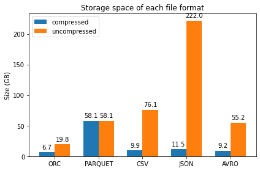

[Code source and results](./assets/conversion.md)

In terms of duration time, the compressed case takes more time in any case even the difference between file format is not significant. Time to convert data respectively to ORC and Parquet is more rapid than text storage in uncompressed case. However in compressed case, parquet format takes lot of time than any other file followed by CSV. 

In CPU time, our reference format `CSV` has the greatest value in any case. This could be explained to the fact the CSV Serde converts all the columns to be a string compared to other serde (JSON, AVRO) which keep the original data type. The CPU cost between JSON and AVRO is quite similar even JSON take less resources than AVRO. Between columnar storage ORC optimizes efficiently in anyhow case than parquet.  

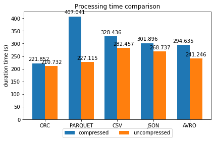

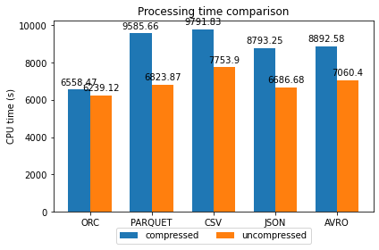

[Code source and results](./assets/conversion.md)

## Reading requests

In this section, the performance comparison is focused on the processing time (CPU and duration time) required for each file format. Some queries are tested such as, aggregation, join, random lookup and eventually additional features.

### Aggregation requests

Data aggregation is the process of gathering data and presenting it in a summarized format. Hive offers several built-in aggregate functions, such as count, max(...), group by(...), and avg(...),... Let's take a look at some of them.

#### - Browsing the entire dataset

The Count (star) without condition is the request type appropriate for browsing your table. It counts the total number of records.

Through our results, ORC is the appropriate one for browsing table then parquet. In trip data, the difference of duration time between row-based storage is insignificant. In terms of CPU time, AVRO uses less resources than other especially for JSON which has the highest value. The data size of imdb is not large for capturing better the difference between file format. That's why it was not included in this case.

With wikipedia, this process is efficient with ORC and Parquet formats. 
However, AVRO takes less time than JSON but in term of CPU the opposite is observed. 

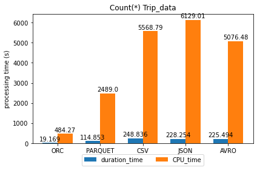

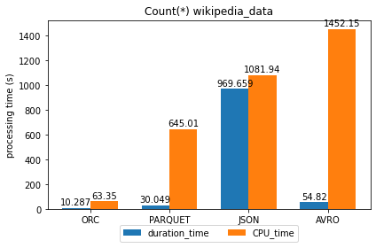

[Code source and results](./assets/request.md)

#### - Fetch the max values

The MAX function is the appropriate one allowing to get the maximum values from numeric column. In any datasets types, ORC and Parquet are suitable for getting quickly the max value. In trip, row storage format has to be avoid in these situations in particular JSON and CSV respectively. In wikipedia, the same observation is noted with count(`*`) query. 

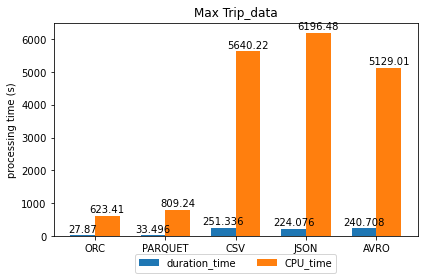

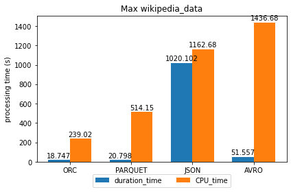

[Code source and results](./assets/request.md)

#### - Grouping data

The GROUP BY statement is used to organize identical data into groups with the help of some functions which can be AVG(), Count(),... As usual, ORC and parquet consume less resources for grouping data compare to row based format. In trip data, grouping data with CSV performs more in duration than JSON and AVRO. About wikipedia, we observed the same trend as the previous queries. 

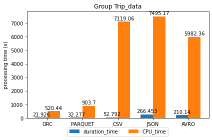


[Code source and results](./assets/request.md)

### JOIN Request 

JOIN links two or many tables together, usually based on the keys that define the relationship between these tables. Thus, the appropriate data type for this is obviously a relational data. Therefore, with one table of data, a self join could be applied if there is a parent~child relationship. However, this is more applicable in a reasonable data size. Because otherwise with a big datasets, the system could be crashed due to the important resources shared from parent~child relation especially in case of text data type. Due to this issue, the join query was not applied in wikipedia data. 

In both data type, ORC and parquet are the best format for joint query compare to row-based format. Between the latter, AVRO optimizes better the CPU time than others in trip. About imdb, the same tendency is observed in AVRO. The duration time is not different but JSON uses important CPU times as observed in trip. 

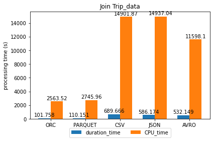

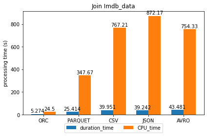

[Code source and results](./assets/request.md)

### Data lookup 

Depending of your data architecture (`structured or semi-structured`), lookup a specific information can generate an overheads of performance according to the filtered index ([primary key or non primary key](https://en.wikipedia.org/wiki/Unique_key#:~:text=A%20non%2Dprimary%20key%20that,in%20a%20single%2Dtable%20select.&text=A%20key%20that%20has%20migrated,unique%20key%20is%20a%20pleonasm.)). With wikipedia, we applied a search on a specific column and as well as all columns. 

With a data structure like trip, ORC and Parquet are the suitable format to search a given information. As usual, row-based storage file consume significant resources especially in CPU time. Between them AVRO provides less time, even if the gap is not too important. Additionally in [Imdb](./feature/plot/lookup_imdb.png), ORC executes rashly this process without generated any metric related to the processing time. This proves that the small size of datasets does not improve mapreduce job as well as to make a good comparison between file format. 

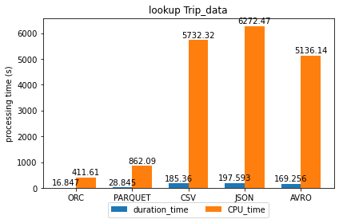

About wikipedia, lookup data into a column based on primary key is very efficient with ORC and Parquet format. In duration time, AVRO is more appropriate than JSON even if it takes lot of CPU resources. With a filter of non-primary key inside a column, ORC and Parquet is always appropriate. This is explained to the fact they include in their definition an index allowing to find data quickly. 

However, we noted that parquet takes less time with a search of information from all columns based on a primary key filter. You can take a look this remark in detail [here](./feature/plot/lookup_all_column_primary_key.png). This previous remark is observed with a non-primary key filter of complex data type (`map type`). This could be explained by the fact parquet is built from the ground up with [complex nested](https://cwiki.apache.org/confluence/display/Hive/Parquet) data structures in mind. However, for optimizing the CPU time, ORC is always the most suitable. Between JSON and AVRO, choice the latter is good for getting quickly the information needed but not in terms of CPU time. 

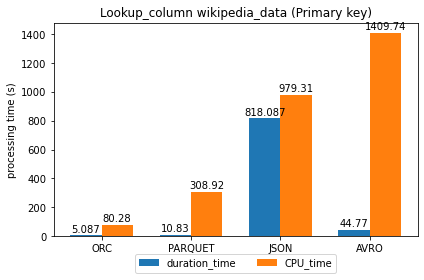


[Code source and results](./assets/request.md)

### Word Count 

In text analysis, the word count request is a task frequently performed. In our case, we found more challenging to apply it in wikipedia due to the complex nested structure of some columns. Because with other dataset, making a word count is similar to `Group by` request.

The results show that ORC and Parquet optimize well this process. JSON has to be avoided in this case because it takes lot of resources. As choice of row format, AVRO is the most appropriate. 

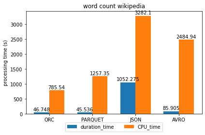

[Code source and results](./assets/request.md)

## Overview

- `Storage file`

The most suitable formats for storing data are ORC and PARQUET. When your storage requires a row-based file format, AVRO can be considered relevant for that and eventually CSV. JSON is not suitable for data storage because it consumes lot of space, especially in uncompressed case. Otherwise, its use could be relevant if it is compressed. 

- `Writing faster`

The appropriate file format for writing faster data depends on the compression case. In uncompressed case, ORC and Parquet are the good choice. But in compressed case, Parquet doesn't seems to be performing. This could be explained by the default compression type of parquet (`Snappy`) used in our case. Since the latter is not splittable, it can’t be processed in parallel using MapReduce. Then, using this type of compression can occurs an overheads performance. 

About row file format, they consume lot of CPU resources for writing data. Even if the difference is insignificant, AVRO provides less processing costs. In addition, Writing data into a CSV format does not a good idea in Hive if you desired to keep the data type of your raw data. Because the Serde CSV will transform all the information to string data type. Thus, the processing time will be degraded as remarked in our results.

- `Reading Faster`

Columnar storage (ORC and Parquet) is remarkable format for reading faster mainly into a specific column. It optimizes efficiently both the duration and CPU resources than row file format. It proves that column-level statistical index included their definition plays its role, which makes irrelevant column blocks skipped in query and improves query performance. Between them, ORC is more efficient than parquet. This is normal because it is the Hive's default format and embeds multiple optimizations properties. Sometimes, parquet can be faster than ORC in data lookup query, especially in nested data structure data.

Reading request is not very efficient with row-base storage. Between them, AVRO takes less resources than others, mainly in terms of CPU time. But in semi-structured data, it doesn't performs well the CPU resources compare to JSON even if it helps to read faster. About JSON, it consumes globally important resources and looks like not appropriate for data analysis. 

## Conclusion

In this tutorial we explored the performance of few file format on a variety of datasets. The columnar file format are globally suitable in anyhow case. Particularly in Hive, ORC is the best one for any type of request. With row-based storage, the duration time can be optimized sometimes by some file as CSV or AVRO but they consumes always lot of CPU resources. The best optimizer which can be considered between them is AVRO even in term of storage space. We hope this tutorial has given you an overview of the performance of the different file formats studied.

## Some tips

- Add data into HDFS

Sometimes, when you try to add data into HDFS, some error could be raised as following:

```
[a.ngom-dsti@edge-1 ~]$ hdfs dfs -put trip_10_13.csv /user/${env:USER}/Taxi_Trip_Record/trip/
20/06/25 16:15:52 INFO hdfs.DataStreamer: Exception in createBlockOutputStream blk_1101247789_27508043
java.io.EOFException: Unexpected EOF while trying to read response from server
        at org.apache.hadoop.hdfs.protocolPB.PBHelperClient.vintPrefixed(PBHelperClient.java:549)
        at org.apache.hadoop.hdfs.DataStreamer.createBlockOutputStream(DataStreamer.java:1762)
        at org.apache.hadoop.hdfs.DataStreamer.nextBlockOutputStream(DataStreamer.java:1679)
        at org.apache.hadoop.hdfs.DataStreamer.run(DataStreamer.java:716)
20/06/25 16:15:52 WARN hdfs.DataStreamer: Abandoning BP-188581868-10.0.0.17-1551214078993:blk_1101247789_27508043
20/06/25 16:15:52 WARN hdfs.DataStreamer: Excluding datanode DatanodeInfoWithStorage[10.0.0.49:1019,DS-8ff05913-5f16-4fa1-aca4-435303d3055a,DISK]
```

Error is caused by saturated storage of file systems. We resolve it by taking up space. Additionally, you can check the health of the file system (number of block, missing files, over replicated, corrupted blocks,...) with the following command:

```bash
hdfs fsck /user/${env:USER}/taxi_trip
```

For more information about your HDFS capacity, this command below may helps.

```
[a.ngom-dsti@edge-1 ~]$ hdfs dfsadmin -report
Configured Capacity: 3809922252800 (3.47 TB)
Present Capacity: 3805824406191 (3.46 TB)
DFS Remaining: 1962398300142 (1.78 TB)
DFS Used: 1843426106049 (1.68 TB)
DFS Used%: 48.44%
Replicated Blocks:
	Under replicated blocks: 4
	Blocks with corrupt replicas: 0
	Missing blocks: 0
	Missing blocks (with replication factor 1): 0
	Low redundancy blocks with highest priority to recover: 0
	Pending deletion blocks: 0
Erasure Coded Block Groups: 
	Low redundancy block groups: 0
	Block groups with corrupt internal blocks: 0
	Missing block groups: 0
	Low redundancy blocks with highest priority to recover: 0
	Pending deletion blocks: 0
```

- Convert our wikipedia datasets to CSV by using CSV Serde of Hive 

The conversion of data to CSV is impossible with complexes data types (`array`, `map`, `struct`,...). Because the [Serde CSV](https://cwiki.apache.org/confluence/display/Hive/CSV+Serde) converts only primitive data (bigint, float, boolean, date,...') type to string. Here, you have an example of this issue encountered when converting wikipedia into CSV format.

```
0: jdbc:hive2://zoo-1.au.adaltas.cloud:2181,z> insert into wikipedia_csv
. . . . . . . . . . . . . . . . . . . . . . .> select * from wikipedia_json;
Error: Error while compiling statement: FAILED: UDFArgumentException The function STRING takes only primitive types (state=42000,code=40000)
```

- Reading error of AVRO table of wikipedia data 

With semi-structured data, if you try to convert data without creating the [Avro schema](https://cwiki.apache.org/confluence/display/Hive/AvroSerDe) manually, it can raise an error when reading as below. 
 
```
0: jdbc:hive2://zoo-1.au.adaltas.cloud:2181,z>select * from wikimedia_avro limit 2;
Error: java.io.IOException: org.apache.avro.AvroTypeException: Found datasets.record_0, expecting union (state=,code=0)
```

This error comes from to the Avro schema. It's due to the column type which may be null or not. These type of column must be defined as union of null and the real type of data if exists like below.

```
{
   "type":"record",
   "name":"wiki_avro",
   "namespace":"test",
   "fields":[
      {
       	 "name":"id",
         "type":[
            "null",
            "string"
         ],
         "default":null
      },
      {
       	 "name":"type",
         "type":[
            "null",
            "string"
         ],
         "default":null
      }]
}

```

You will get further information about this error from the log of Hive server and even a suggested schema of your table.
